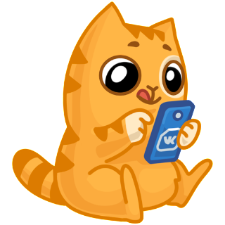
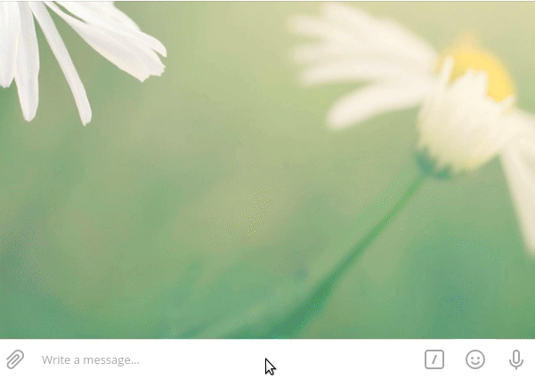
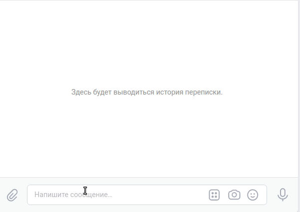

# Проводим викторину

### Описание проекта
Доступно 2 бота: телеграмм бот и vk бот.  \
В каждом из них есть три кнопки:
- `Новый вопрос` – получить рандомный вопрос из викторины. При ответе на вопрос бот сообщит правильно ли вы ответили.
- `Сдаться` – бот покажет правильный ответ на вопрос.
- `Мой счет` – пока в разработке.
Пример результата для Telegram: \
 \
Пример результата для ВКонтакте: \

### Как запустить
Для запуска на своем компьютере вам потребуется:

1. Свежая версия [Python](https://www.python.org).
2. Сохранить библиотеку на свой компьютер:
```
git clone https://github.com/inkvizitor1991/vk_tg_quiz.git
``` 
3. Установить зависимости:
```
pip install -r requirements.txt
``` 
4. Создать словарь с вопросами и ответами для ботов:
```
python create_dictionary_questions_answers.py
```
5. Запустить телеграмм бот:
```
python tg_quiz.py
``` 
6. Запустить vk бот:
```
python tg_quiz.py
```
### Переменные окружения

Часть настроек проекта берётся из переменных окружения. Чтобы их определить, создайте файл `.env` в корне проекта и запишите туда данные в таком формате: `ПЕРЕМЕННАЯ=значение`.

Доступны следующие переменные:
- `TG_BOT_TOKEN` — токен телеграм бота. Создать бота и получить токен можно у [BotFather](https://telegram.me/BotFather), для этого необходимо ввести `/start` и следовать инструкции.
- `CHAT_ID` — чтобы получить свой `chat_id`, напишите в `Telegram` специальному боту: `@userinfobot`.
- `VK_GROUP_TOKEN` — создайте группу [в контакте](https://vk.com/groups) и в разделе: `Работа с API`, получите токен.
- `REDIS_DATABASE_PASSWORD` — пароль от вашей базы данных, заведите базу данных на [redis](https://redis.com/).
- `REDIS_PORT` — порт от вашей базы данных [redis](https://redis.com/).
- `REDIS_HOST` — адрес от вашей базы данных [redis](https://redis.com/).